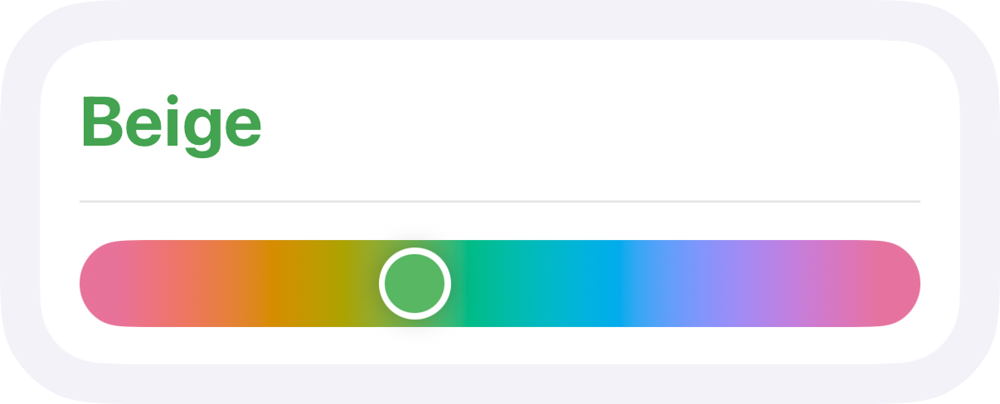
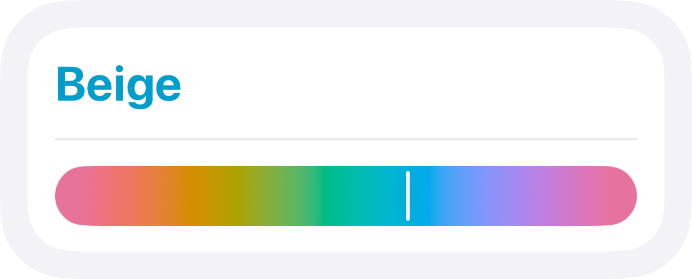

# Beige - SwiftUI OKLCH-based color picker


 


## About

Beige is a color picker made with the OKLCH perceptual color space. It also includes a toolkit for OKLAB and OKLCH colors.



### What is OKLCH and why is it good?

OKLAB and OKLCH are perceptual color spaces created by [Björn Ottosson](https://bottosson.github.io/posts/oklab/). Perceptual means that to the human eye color contrast and brightness can be constant across the whole hue spectre. 

### What situations is Beige designed for?

Beige is perfect for making app customization easy for users. It's a single slider so it's easy to understand and because of perceptual color space the colors will always remain readable in any context.

## Installation

### Swift Package Manager

In Xcode follow `File -> Add Package Dependencies`, then paste the [link](https://github.com/PinkXaciD/Beige) to this repo.

## Usage

### Color Picker

The color picker is a single slider which only changes the hue while preserving lightness and chroma.

It will produce haptic feedback when it reaches minimum or maximum values with certain velocity, mimicking system sliders behavior.

Import Beige to your View file:

```
import Beige
```

Now you need to create a `@State` variable in your view with the `OKLCH` type:

```
@State var color = OKLCH(lightness: 0.7, chroma: 0.15, hue: 0)
```

You can use the color picker with that variable in your View:

```
BeigeColorPicker(oklch: $color)
```

> ### Note
> `BeigeColorPicker` will take lightness and chroma values from the binding.

You can disable haptic feedback by setting `playHaptics` to `false`. `hideHandle` controls whether the slider handle collapses into a line. And you can set a `cornerRadius` of the picker.

```
BeigeColorPicker(oklch: $color, playHaptics: false, hideHandle: false, cornerRadius: 20)
```

> Hidden handle will look like this:
> 

### Colors

Beige provides tools to manage colors in `OKLCH` and `OKLAB` color spaces, for example new initializers for SwiftUI Color - `init(lightness: Double, chroma: Double, hue: Double)` for OKLCH and `init(lightness: Double, a: Double, b: Double)` for OKLAB. 

Beige also gives you two structures: `OKLCH` and `OKLAB`. These structures can help you manage colors in these color spaces directly. They conform to `View` and `ShapeStyle` protocols so you can use them just like regular SwiftUI Colors without converting them every time. 

`ShapeStyle` conformance is only available from iOS 17 or macOS 14. If you need to use it on older versions (for filling shapes for example) you can call a `color` computed property from these structures.

```
let oklch = OKLCH(lightness: 0.7, chroma: 0.15, hue: 340)

// Available from iOS 17 and macOS 14

Circle()
    .fill(oklch)

// On older systems

Circle()
    .fill(oklch.color)

// Or you can use the OKLCH object as a View itself

OKLCH(lightness: 0.7, chroma: 0.15, hue: 250)
    .clipShape(Circle())
```

The `OKLCH` object gives you a method to shift its parameters by given amount. For example you can adjust `lightness` of a color depending on the `colorSheme` of your app.

```
@Environment(\.colorSheme) var colorScheme

// Reducing lightness of a color in light mode and increasing it in dark mode

Circle()
    .fill(oklch.shift(lightness: colorSheme == .light ? -0.06 : 0.06))
```

All conversions use unclamped sRGB, meaning colors won't fall back to sRGB if you're using larger color spaces like Apple's Display P3.

Beige types are convertible both between themselves and SwiftUI Color.

## License

*This code is available under the MIT license. [Learn more.](LICENSE)*
